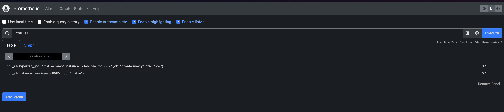
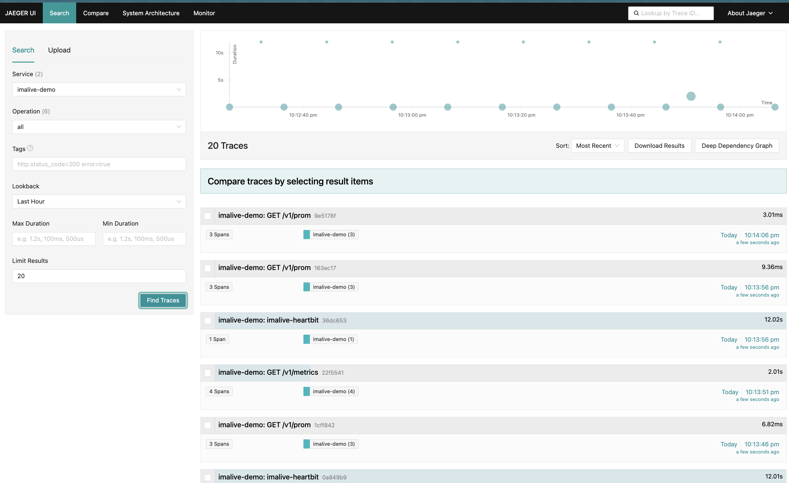

# Im Alive

👋 Welcome to Im Alive metrics exporter!

<p align="center">
    
</p>

Let your raspberry pi nodes (or any computer/virtual machines as well) sing like Céline Dion `I'm alive!`.

<p align="center">
    
</p>

Just a dummy healthcheck api and metric exporterfor your nodes (support x86 and armhf for raspberrypi). It's also supported by [comwork cloud](https://doc.cloud.comwork.io/docs/tutorials/imalive).

It provide a http/restful endpoint that you can use as a healthcheck rule to your loadbalancer and also publish a heartbit in stdout (usefull if you collect it in a log/alerting management system such as elasticstack).


It's also providing a `/v1/prom` http metrics endpoint that can be scrap by Prometheus:



And can also send the metrics and some traces through OTLP/Grpc. Here's example of traces with Jaegger:



## Table of content

[[_TOC_]]

## Git repositories

* Main repo: https://gitlab.comwork.io/oss/imalive
* Github mirror: https://github.com/comworkio/imalive.git
* Gitlab mirror: https://gitlab.com/ineumann/imalive.git

## Image on the dockerhub

The image is available and versioned here: https://hub.docker.com/r/comworkio/imalive-api

An example of exposed API instance: https://imalive.comwork.io

## Getting started

### Running with ansible

You can use this [ansible role](./ansible-imalive).

### Running with docker-compose

First create your `.env` file from the `.env.example`:

```shell
cp .env.example .env
```

Then replace the values (like the `IMALIVE_NODE_NAME` with your node name). Then:

```shell
$ docker-compose up
```

You can check the API on [localhost:8080/docs](http://localhost:8080/docs) to see the Swagger docs.

If you want to test on a raspberrypi or any other ARM device, use this command instead:

```shell
$ docker-compose -f docker-compose-arm.yml up
```

### Running with K3D (Kubernetes / helm)

Use our helm chart [here](./helm)

#### Test with K3D (init the cluster)

```shell
k3d cluster create localdev --api-port 6550 -p "8089:80@loadbalancer"
sudo k3d kubeconfig get localdev > ~/.kube/config 
```

Continue to the next chapter

#### Install the helmchart

```shell
cd helm # all the commands below must be under imalive/helm directory
kubectl create ns imalive
helm dependency update
helm -n imalive install . -f values.yaml --generate-name
```

#### Check the deployment and ingress

```shell
kubectl -n imalive get deployments
kubectl -n imalive get pods
kubectl -n imalive get svc
kubectl -n imalive get ingress
curl localhost:8089 -v
```

## Endpoints

### Healthcheck

```shell
$ curl localhost:8080/v1/health
{"status": "ok", "time": "2021-11-05T06:55:28.274736", "alive": true, "name": "anode"}
```

### Manifests

```shell
$ curl localhost:8080/v1/manifest 
{"version": "1.0", "sha": "1c7cb1f", "arch": "x86"}
```

### Metrics

```shell
$ curl localhost:8080/v1/metrics
{"status": "ok", "disk_usage": {"total": 102.11687469482422, "used": 22.499202728271484, "free": 74.402099609375}, "virtual_memory": {"total": "1.9G", "available": "984.7M"}, "swap_memory": {"total": "1024.0M", "used": "493.1M", "free": "530.9M", "percent": 48.2}, "cpu": {"percent": {"all": 2.8, "percpu": [5.0, 4.0, 3.0, 2.0]}, "count": {"all": 4, "with_logical": 4}, "times": {"all": [10665.39, 7.0, 4718.91, 400345.0, 156.08, 0.0, 226.8, 0.0, 0.0, 0.0], "percpu": [[2488.92, 1.24, 1196.15, 100191.67, 38.08, 0.0, 82.3, 0.0, 0.0, 0.0], [2757.78, 1.63, 1196.16, 99992.0, 37.88, 0.0, 55.78, 0.0, 0.0, 0.0], [2704.56, 2.05, 1162.12, 100082.77, 40.01, 0.0, 47.75, 0.0, 0.0, 0.0], [2714.11, 2.06, 1164.46, 100078.54, 40.1, 0.0, 40.96, 0.0, 0.0, 0.0]]}}}
```

### Metrics for prometheus

If you want to use `imalive` as a Prometheus metrics exporter, this is the way:

```shell
$ curl localhost:8080/v1/prom
# HELP cpu_all cpu usage in percent
# TYPE cpu_all gauge
cpu_all 0.2
# HELP ram_total total of ram
# TYPE ram_total gauge
ram_total 5.1
# HELP ram_available available ram
# TYPE ram_available gauge
ram_available 4.4
# HELP disk_free free storage's space
# TYPE disk_free gauge
disk_free 43.546470642089844
# HELP disk_used used storage's space
# TYPE disk_used gauge
disk_used 12.563823699951172
# HELP disk_total total storage's space
# TYPE disk_total gauge
disk_total 56.096561431884766
# HELP imalive_imalive_http_reques
```

Here's an example of Prometheus config for scraping the data:

```yaml
global:
  scrape_interval: 10s

scrape_configs:
  - job_name: 'imalive'
    static_configs:
      - targets: ['imalive-api:8080']
    metrics_path: '/v1/prom'
    scheme: http
```

## Heartbit

You can change the wait time between two heartbit with the `WAIT_TIME` environment variable (in seconds).

Here's an example of stdout heartbit:

```shell
[2021-11-06T14:45:33.902885][anode] I'm alive! metrics = {'status': 'ok', 'disk_usage': {'total': 102.11687469482422, 'used': 22.521244049072266, 'free': 74.38005828857422}, 'virtual_memory': {'total': '1.9G', 'available': '959.0M'}, 'swap_memory': {'total': '1024.0M', 'used': '493.1M', 'free': '530.9M', 'percent': 48.2}, 'cpu': {'percent': {'all': 3.5, 'percpu': [8.0, 5.0, 6.1, 11.0]}, 'count': {'all': 4, 'with_logical': 4}, 'times': {'all': scputimes(user=10679.53, nice=7.01, system=4727.11, idle=401080.72, iowait=156.27, irq=0.0, softirq=227.12, steal=0.0, guest=0.0, guest_nice=0.0), 'percpu': [scputimes(user=2492.49, nice=1.24, system=1198.2, idle=100375.46, iowait=38.16, irq=0.0, softirq=82.38, steal=0.0, guest=0.0, guest_nice=0.0), scputimes(user=2760.93, nice=1.64, system=1198.27, idle=100176.24, iowait=37.93, irq=0.0, softirq=55.87, steal=0.0, guest=0.0, guest_nice=0.0), scputimes(user=2708.45, nice=2.06, system=1164.18, idle=100266.4, iowait=40.04, irq=0.0, softirq=47.82, steal=0.0, guest=0.0, guest_nice=0.0), scputimes(user=2717.65, nice=2.06, system=1166.46, idle=100262.62, iowait=40.12, irq=0.0, softirq=41.03, steal=0.0, guest=0.0, guest_nice=0.0)]}}}
[2021-11-06T14:45:45.914750][anode] I'm alive! metrics = {'status': 'ok', 'disk_usage': {'total': 102.11687469482422, 'used': 22.52124786376953, 'free': 74.38005447387695}, 'virtual_memory': {'total': '1.9G', 'available': '959.8M'}, 'swap_memory': {'total': '1024.0M', 'used': '493.1M', 'free': '530.9M', 'percent': 48.2}, 'cpu': {'percent': {'all': 2.0, 'percpu': [2.0, 3.0, 2.0, 4.0]}, 'count': {'all': 4, 'with_logical': 4}, 'times': {'all': scputimes(user=10680.4, nice=7.01, system=4727.63, idle=401126.91, iowait=156.28, irq=0.0, softirq=227.13, steal=0.0, guest=0.0, guest_nice=0.0), 'percpu': [scputimes(user=2492.68, nice=1.24, system=1198.34, idle=100387.01, iowait=38.17, irq=0.0, softirq=82.38, steal=0.0, guest=0.0, guest_nice=0.0), scputimes(user=2761.19, nice=1.64, system=1198.36, idle=100187.77, iowait=37.93, irq=0.0, softirq=55.87, steal=0.0, guest=0.0, guest_nice=0.0), scputimes(user=2708.66, nice=2.06, system=1164.31, idle=100277.96, iowait=40.04, irq=0.0, softirq=47.83, steal=0.0, guest=0.0, guest_nice=0.0), scputimes(user=2717.86, nice=2.06, system=1166.61, idle=100274.16, iowait=40.12, irq=0.0, softirq=41.03, steal=0.0, guest=0.0, guest_nice=0.0)]}}}
[2021-11-06T14:45:57.924797][anode] I'm alive! metrics = {'status': 'ok', 'disk_usage': {'total': 102.11687469482422, 'used': 22.52124786376953, 'free': 74.38005447387695}, 'virtual_memory': {'total': '1.9G', 'available': '963.0M'}, 'swap_memory': {'total': '1024.0M', 'used': '493.1M', 'free': '530.9M', 'percent': 48.2}, 'cpu': {'percent': {'all': 2.5, 'percpu': [4.0, 3.0, 2.0, 4.0]}, 'count': {'all': 4, 'with_logical': 4}, 'times': {'all': scputimes(user=10681.23, nice=7.01, system=4728.14, idle=401173.13, iowait=156.28, irq=0.0, softirq=227.15, steal=0.0, guest=0.0, guest_nice=0.0), 'percpu': [scputimes(user=2492.87, nice=1.24, system=1198.47, idle=100398.59, iowait=38.17, irq=0.0, softirq=82.39, steal=0.0, guest=0.0, guest_nice=0.0), scputimes(user=2761.37, nice=1.64, system=1198.5, idle=100199.34, iowait=37.93, irq=0.0, softirq=55.88, steal=0.0, guest=0.0, guest_nice=0.0), scputimes(user=2708.91, nice=2.06, system=1164.42, idle=100289.48, iowait=40.04, irq=0.0, softirq=47.83, steal=0.0, guest=0.0, guest_nice=0.0), scputimes(user=2718.07, nice=2.06, system=1166.75, idle=100285.71, iowait=40.12, irq=0.0, softirq=41.04, steal=0.0, guest=0.0, guest_nice=0.0)]}}}
```

You can change `anode` by your node name with the `IMALIVE_NODE_NAME` environment variable.

You also can log only a json output by making the environment variable `LOG_FORMAT` equal "json".

## OpenTelemetry

You can also configure an OTEL Grpc endpoint using the `OTEL_COLLECTOR_ENDPOINT` environment variable.

Here's an example of Prometheus configuration for scrapping the opentelemetry collector metrics:

```yaml
global:
  scrape_interval: 10s

scrape_configs:
  - job_name: 'opentelemetry'
    static_configs:
      - targets: ['otel-collector:8889']
```

And the opentelemetry collector configuration as well for receiving the traces and metrics from imalive:

```yaml
receivers:
  otlp:
    protocols:
      grpc:
      http:

exporters:
  logging:
  prometheus:
    endpoint: "0.0.0.0:8889"
    const_labels:
      otel: otel
  otlp:
    endpoint: "jaeger:4317"
    tls:
      insecure: true

processors:
  batch:

service:
  pipelines:
    metrics:
      receivers: [otlp]
      exporters: [prometheus]
    traces:
      receivers: [otlp]
      exporters: [otlp]
    logs:
      receivers: [otlp]
      processors: [batch]
      exporters: [logging]
```

## Monitor features

Imalive is also able to check some http endpoint and log and export metrics (status and duration).

In order to use that, just override the `/app/imalive.yml` with the following content:

```yaml
---
monitors:
  - type: http
    name: imalive
    url: http://localhost:8081
    method: POST # optional (GET by default, only POST, PUT and GET are supported)
    body: '{"foo": "bar"}' # optional (body is ignored if method is GET)
    expected_http_code: 200 # optional (200 by default)
    expected_contain: "\"status\":\"ok\"" # optional (no check on the body response if not present)
    timeout: 30 # optional (30 seconds if not present)
    username: changeit # optional (no basic auth if not present)
    password: changeit # optional (no basic auth if not present)
    headers: # optional (no headers if empty)
      - name: Accept
        value: application/json
```

## Development / contributions

Go see this [documentation](./CONTRIBUTING.md)
